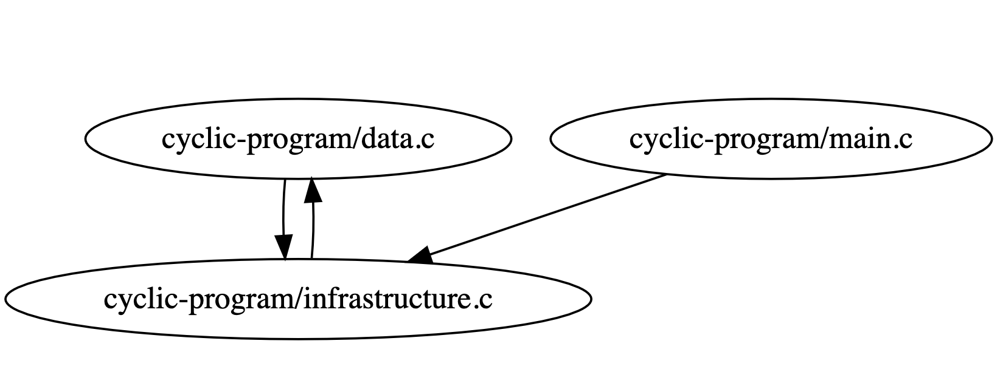
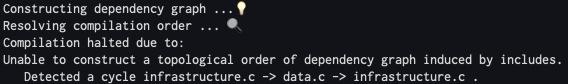

# mcc

> "clang done worse :P"

**mcc** is a toy compiler compiling a (relatively) large subset of **C** language to **LLVM IR**. 

**mcc** is written entirely in Haskell and it started as a hobby project, done by [@me](https://github.com/gboduljak) and [@its-sami](https://github.com/its-sami). Most of this compiler has been **pair programmed** during our summer break.

There are a few differences between the subset of **C** in specification of **C** language and the language being compiled by **mcc**. **mcc** compiles the subset which we call **mini C**.

**mini C** is an extension of the programming language used in [compiling techniques](https://www.inf.ed.ac.uk/teaching/courses/ct/19-20/) course by The University of Edinburgh.

Features of **mini C** are:
- the syntax exactly the same as **C**
- **mini C**'s primitive types are only **void, int, double, char**
- structs and arrays of arbitrary dimension are supported
- passing structs by reference
- passing structs by value

Key differences between **mini C** and **C** are:
- **mini C** has a built-in includes preprocessor which either resolves the compilation order of given source files or logs the presence of a cycle
- **mini C** does not support function pointers
- **mini C** does not support many implicit casts
- **mini C** does not support postfix operators such as ```i++```
- **mini C** does not support variable declaration and assignment in the same line
- **mini C** does not have formal and operational semantics :(

Lexical structure of **mini C** is equivalent to the lexical structure of the relevant subset of **C**.
Syntax of **mini C** is formally specified by the [grammar](./grammar). 

## Architecture
**mcc** follows the classical guidelines of compiler construction,
adapted to the functional programming paradigm. 

Therefore, **mcc** is split in five stages:
-  lexical analysis
-  preprocessing includes
-  syntax analysis (parsing)
-  semantic analysis (typechecking and abstract syntax tree rewriting)
-  LLVM code generator

In design of a **mcc**'s frontend, we employ various functional programming concepts.

We make use of monads and monad transformers to isolate effectfull computation. This means that each stage is encapsulated in its own monad stack and exposed as a pure function. 

Examples:

**Pratt Parser** is a monad stack exposed as a pure function **parse**.

```haskell
data ParserState = ParserState
  { input :: [T.Token],
    offset :: Int,
    errors :: [ParserError]
  }

type Parser a = ExceptT ParserError (State ParserState) a

parse :: String -> [T.Token] -> Either (ParseErrorBundle TokenStream Void) Ast.Program
parse file tokens = ...
```

**Codegen Monad** exposed as a pure function **compile**.

```haskell
type LLVM = ModuleBuilderT (State (Env Operand))
type Codegen = IRBuilderT LLVM

compile :: String -> SProgram -> LLVM.AST.Module
compile name program = evalState (buildModuleT (cs name) (generateProgram program)) emptyEnv
```

We use parser combinators to implement both lexical and syntax analysis.

There are two parsers written using [Megaparsec](https://hackage.haskell.org/package/megaparsec-9.1.0) parser combinators. However, the default parser used is a custom, parser combinator parser based on [Pratt](https://tdop.github.io/)'s top down operator precedence algorithm.

### Lexical Analysis


Lexical Analysis is implemented in two ways. We have an **ad hoc** and **parser combinator** version.
From theoretical standpoint, **ad hoc** is a classic hand-coded DFA lexer. **Parser combinator** lexer is a top down parser for regular grammar describing the lexical structure of **mini C**.

We use **alex** generated lexer as a ground truth in unit testing, but it is not a part of compiler itself. 
### Includes Preprocessor

Prior to the parsing stage, **mcc** constructs a dependency graph induced by includes and attempts to construct the **topological ordering**, reporting if such an ordering is impossible (i.e cyclic dependencies). 

[An example program](readme-examples/cyclic-program/)

-  main.c
```c
#include "infrastructure.c"

int main () {
  printf("I am cyclic :(");
}
```
-  data.c
```c
#include "infrastructure.c"
```
- infrastructure.c
```c
#include "data.c"
```
**mcc** will output the following graph in the build folder (**build/compilation-order.dot**).





The algorithm used is classic DFS.

### Syntax Analysis

The default method (method of choice) is a variant of **Pratt** top down operator precedence parser with error recovery.

Apart from **Pratt** parser, there are two more parsers implemented using **Megaparsec** combinator library. 

**Pratt** is implemented from scratch, delivering (probably) best error messages and overall the best error recovery.

We use **happy** generated parser (LR(k)) as a ground truth in unit testing, but it is not a part of compiler itself.

### Semantic Analysis

Classic tree walk typechecking, adapted to functional programming paradigm.

Apart from just typechecking, we perform:
- rewriting of pointer indirection (```->```) into a field access on dereferenced expression
- we rewrite all loops into do while to simplify code generation

### LLVM Code generation

Classic tree walk compilation, adapted to functional programming paradigm.


## Appendix - Syntax of mini C

```
program ::= (include)* (construct)* EOF

construct ::= structdecl
            | vardecl
            | funcdecl
            | funcdefn

include ::= Include LitString

structdecl ::= Struct Ident LBrace (vardecl)+ RBrace Semi

vardecl ::= type Ident [LBrack LitInt RBrack]* Semi

funcdecl ::= type Ident LParen formals RParen Semi
           | type Ident LParen RParen Semi

funcdefn ::= type Ident LParen formals RParen block

type ::= primitive_type
       | struct_type

primitive_type ::= (Type BuiltinType) stars
struct_type    ::= Struct Ident stars
sizeof_type    ::= type [Int]*

BuiltinType ::= Int
              | Double
              | Char
              | Void

stars ::= (Asterisk)*

formals ::= [ type Ident (Comma type Ident)* ]

stmt ::= expr Semi
       | block
       | While LParen expr RParen stmt
       | For LParen [expr] Semi [expr] Semi [expr] RParen stmt
       | If LParen expr RParen stmt
       | If LParen expr RParen stmt Else stmt
       | Return [expr] Semi
       | vardecl

block ::= LBrace [stmt]* RBrace

expr ::= LitInt
       | LitString
       | LitChar
       | LitDouble
       | LitNull
       | Ident
       | (expr)
       | expr op expr
       | Minus expr
       | Not expr
       | arrayaccess
       | fieldaccess
       | indirect
       | deref
       | addressof
       | funccall
       | assign
       | sizeof
       | typecast

op ::= Less
     | Leq
     | Greater
     | Geq
     | Neq
     | Equal
     | Plus
     | Minus
     | Div
     | Asterisk
     | Mod
     | Or
     | And
     | Caret
     | Ampers
     | Bar

funccall    ::= Ident LParen actuals RParen
              | Ident LParen RParen
arrayaccess ::= expr LBrack expr RBrack
fieldaccess ::= expr Dot Ident
indirect    ::= expr Arrow Ident
deref       ::= Asterisk expr
addressof   ::= Ampers expr
sizeof      ::= Sizeof LParen type RParen
              | Sizeof LParen expr RParen
typecast    ::= LParen type RParen expr
assign      ::= expr Assign expr

actuals ::= expr
          | actuals ',' expr
```