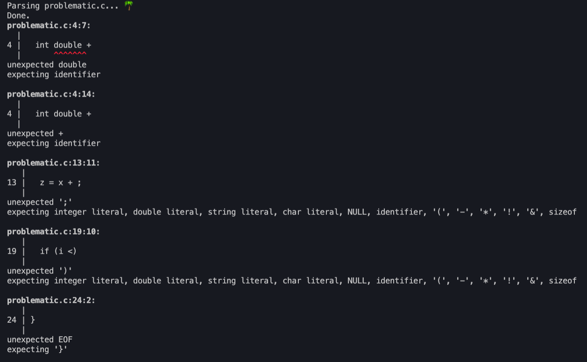
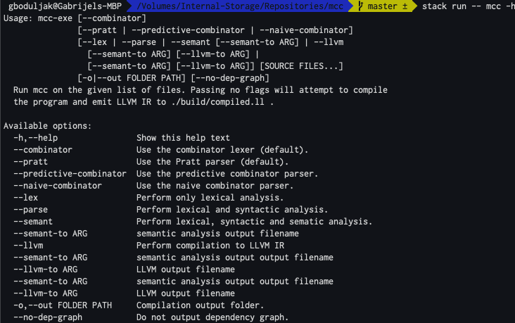

# mcc

> "clang done worse :P"

**mcc** is a toy compiler compiling a (relatively) large subset of **C** language to **LLVM IR**. 

**mcc** is written entirely in Haskell and it started as a hobby project, done by [@me](https://github.com/gboduljak) and [@its-sami](https://github.com/its-sami). Most of this compiler has been **pair programmed** during our summer break.

There are a few differences between the subset of **C** in specification of **C** language and the language being compiled by **mcc**. **mcc** compiles the subset which we call **mini C**.

**mini C** is an extension of the programming language used in [compiling techniques](https://www.inf.ed.ac.uk/teaching/courses/ct/19-20/) course by The University of Edinburgh.

Features of **mini C** are:
- the syntax exactly the same as **C**
- **mini C**'s primitive types are only **void, int, double, char**
- structs and arrays of arbitrary dimension are supported
- passing structs by reference
- passing structs by value

Key differences between **mini C** and **C** are:
- **mini C** has a built-in includes preprocessor which either resolves the compilation order of given source files or logs the presence of a cycle
- **mini C** does not support function pointers
- **mini C** does not support many implicit casts
- **mini C** does not support postfix operators such as ```i++```
- **mini C** does not support variable declaration and assignment in the same line
- **mini C** does not have formal and operational semantics :(

Lexical structure of **mini C** is equivalent to the lexical structure of the relevant subset of **C**.
Syntax of **mini C** is formally specified by the [grammar](./grammar). 

## Architecture
**mcc** follows the classical guidelines of compiler construction,
adapted to the functional programming paradigm. 

Therefore, **mcc** is split in five stages:
-  lexical analysis
-  preprocessing includes
-  syntax analysis (parsing)
-  semantic analysis (typechecking and abstract syntax tree rewriting)
-  LLVM code generator

In design of a **mcc**'s frontend, we employ various functional programming concepts.

We make use of monads and monad transformers to isolate effectfull computation. This means that each stage is encapsulated in its own monad stack and exposed as a pure function. 

Examples:

**Pratt Parser** is a monad stack exposed as a pure function **parse**.

```haskell
data ParserState = ParserState
  { input :: [T.Token],
    offset :: Int,
    errors :: [ParserError]
  }

type Parser a = ExceptT ParserError (State ParserState) a

parse :: String -> [T.Token] -> Either (ParseErrorBundle TokenStream Void) Ast.Program
parse file tokens = ...
```

**Codegen Monad** exposed as a pure function **compile**.

```haskell
type LLVM = ModuleBuilderT (State (Env Operand))
type Codegen = IRBuilderT LLVM

compile :: String -> SProgram -> LLVM.AST.Module
compile name program = evalState (buildModuleT (cs name) (generateProgram program)) emptyEnv
```

We use parser combinators to implement both lexical and syntax analysis.

### [Lexical Analysis](src/Lexer)


Lexical Analysis is implemented in two ways. We have an **ad hoc** and **parser combinator** version.
From theoretical standpoint, **ad hoc** is a classic hand-coded DFA lexer. **Parser combinator** lexer is a top down parser for regular grammar describing the lexical structure of **mini C**.

We use **alex** generated lexer as a ground truth in unit testing, but it is not a part of compiler itself. 
### [Includes Preprocessor](src/Preprocessor/)

Prior to the parsing stage, **mcc** constructs a dependency graph induced by includes and attempts to construct the **topological ordering**, reporting if such an ordering is impossible (i.e cyclic dependencies). 

[An example program](readme-examples/cyclic-program/)

-  main.c
```c
#include "infrastructure.c"

int main () {
  printf("I am cyclic :(");
}
```
-  data.c
```c
#include "infrastructure.c"
```
- infrastructure.c
```c
#include "data.c"
```
**mcc** will output the following graph in the build folder (**build/compilation-order.dot**).


The algorithm used is a classic DFS topological ordering, described in [CLRS](https://en.wikipedia.org/wiki/Introduction_to_Algorithms).

### [Syntax Analysis](src/Parser)

Prior to the syntax analysis, we have manually rewritten the grammar to remove ambiguity by stratifying expression productions
into precedence levels. We have also factored the grammar where it improved readability. You can find grammars [here](./grammar).

From theoretical standpoint, every parser we implemented is a predictive LL(K) recursive descent.

The default parser (method of choice) is a variant of **Pratt** top down operator precedence parser with custom error recovery.
Error recovery is classical panic mode based on FOLLOW sets of expression, statement and construct level productions.

There are two parsers written using [Megaparsec](https://hackage.haskell.org/package/megaparsec-9.1.0) parser combinators. However, the default parser used is a custom, parser combinator parser based on [Pratt](https://tdop.github.io/)'s top down operator precedence algorithm.

**Pratt** is implemented from scratch, delivering (probably) best error messages and overall the best error recovery.

Example:

```c
struct problematic
{
  int double +
  double x;
};

double f() {
  int x;
  int y;
  z = x + ;
}

int main() {
  if (i <)
  {
    /* code */
  
}
```



Parser combinator approach proved to be very readable. 
Most of subparsers are very simple descriptions of parsing
actions to be performed, closely resembling grammar itself. 

```haskell
while :: Parser Ast.Statement
while = do
  off <- getOffset
  expect L.While
  cond <- between (expect L.LParen) (expect L.RParen) expr
  body <- statement
  return (Ast.While cond body off)

statement :: Parser Ast.Statement
statement =
  exprStmt <|> varDeclStmt
    <|> blockStmt
    <|> returnStmt
    <|> while
    <|> for
    <|> if'
  where
    exprStmt = do exp <- expr; expect Semi; return (Ast.Expr exp (getExprOff exp))
    blockStmt = do block' <- block; Ast.BlockStatement block' <$> getOffset
    returnStmt = do ret <- return'; expect Semi; return ret
    varDeclStmt = do
      off <- getOffset
      typ <- type'
      nameId <- ident
      decl <- varDecl off typ (varName nameId)
      return (Ast.VarDeclStatement decl off)
      where
        varName (Ast.Ident name _) = name
        varName _ = undefined
```
Main reason why we decided to make Pratt parser default is significantly better error recovery, which is still far away from being 'good' :)

Pratt parser was very interesting to implement and it required development of various custom combinators, such as [lookchainl1](src/Parser/Pratt/Combinator/../Combinators/Chains.hs) which is based on **chainl1** combinator described in [Monadic parsing paper](http://www.cs.nott.ac.uk/~pszgmh/pearl.pdf) by E.Meijer and G.Hutton. This combinator conveniently captures left recursion ocurring in expressions.

```haskell
lookchainl1 :: Parser a -> (L.Lexeme -> Bool) -> Parser (a -> a) -> Parser a
lookchainl1 p pred op = do left <- p; rest left
  where
    rest left =
      lookahead >>= \lexeme -> do
        if pred lexeme
          then do
            f <- op
            rest (f left)
          else do return left
```

We use **happy** generated LR(k) parser as a ground truth in unit testing, but it is not a part of compiler itself.
### Semantic Analysis

#### [Monadic Symbol Table](src/SymbolTable)

Both Semantic Analysis and Code Generation rely heavily on generic monadic Symbol Table,
used to capture lexical scoping and provide convenient interface for scoping management.

Interesting note is that Symbol Table does not exist as a data structure itself, but it is a collection of monadic actions operating on **State Monads** storing **Scoping Environments**.

```haskell
data Scope a = Scope
  { id :: ScopeId,
    parentId :: Maybe ScopeId,
    symbolTable :: Map String a
  }
  deriving (Show, Eq)

class ScopingEnv e where 
    scopes :: e a -> Map ScopeId (Scope a)
    currentScopeId :: e a -> ScopeId
    modifyScopes :: e a -> Map ScopeId (Scope a) -> e a
    modifyCurrentScopeId :: e a -> ScopeId -> e a
```

**enterScope** defined on any scoping state monad.
```haskell
enterScope :: forall e a m .
  (
    ScopingEnv e,
    MonadState (e a) m,
    Show a,
    Eq a
  ) =>  m (Scope a)
enterScope = do
  scopes <- gets scopes
  scopeId <- gets currentScopeId
  newScope <- createScope (Just scopeId)
  let newScopeId = id newScope
  let newScopes = Map.insert (id newScope) newScope scopes
  modify (`modifyScopes` newScopes)
  modify (`modifyCurrentScopeId` newScopeId)
  return newScope
```
Semantic Analyser is module divided into several smaller analysers:
  - [Expressions Analyser](src/Semant/Analysers/ExpressionsAnalyser.hs)
  - [Statements Analyser](src/Semant/Analysers/StatementsAnalyser.hs)
  - [Funcs Analyser](src/Semant/Analysers/FuncsAnalyser.hs)
  - [Structs Analyser](src/Semant/Analysers/StructsAnalyser.hs)

Each analyser is a module exporting monadic semantic analysis actions which usually destruct nodes of abstract syntax tree.

Semantic analysis implements classic tree walk typechecking, adapted to functional programming paradigm.
We do not employ attributed grammars. Instead, we directly implement typing rules, relying on Haskell's powerful pattern matching capabilities.


Example of pattern matching on types and expression structure.

```haskell
analyseExpr expr@(Assign left right _) = do
  left'@(leftTyp, leftExpr) <- analyseExpr left
  right'@(rightTyp, _) <- analyseExpr right

  if (not . isLValue) leftExpr
    then
      registerError (AssignmentError left right)
        >> return (Any, SAssign left' right')
    else case (leftTyp, rightTyp) of
      (Any, _) -> return (Any, SAssign left' right')
      (_, Any) -> return (Any, SAssign left' right')
      (_, Scalar (PrimitiveType Void 1)) -> do
        if isPointer leftTyp
          then return (leftTyp, SAssign left' right')
          else do
            registerError (AssignmentError left right)
            return (Any, SAssign left' right')
      (_, _) -> do
        if leftTyp == rightTyp && (not . isArray) leftTyp -- arrays are not assignable
          then return (leftTyp, SAssign left' right')
          else
            registerError (AssignmentError left right)
              >> return (Any, SAssign left' right')
```


Apart from just typechecking, we perform:
- rewriting of pointer indirection (```->```) into a field access on dereferenced expression
- we rewrite all loops into do while to simplify code generation

Rewriting loops into do-whiles.
```haskell
rewriteAsDoWhile :: SExpr -> SExpr -> SStatement -> SExpr -> SStatement
rewriteAsDoWhile init' (_, SEmptyExpr) body' incr' =
  SBlockStatement
    ( blockify
        [ SExpr init',
          SDoWhile
            (Scalar (PrimitiveType Int 0), SLitInt 1)
            (SBlockStatement $ blockify [body', SExpr incr'])
        ]
    )
rewriteAsDoWhile init' cond' body' incr' =
  SBlockStatement
    ( blockify
        [ SExpr init',
          SIf
            cond'
            ( SDoWhile
                cond'
                (SBlockStatement $ blockify [body', SExpr incr'])
            )
            Nothing
        ]
    )

blockify :: [SStatement] -> SBlock
blockify stmts = SBlock [stmt | stmt <- stmts, stmt /= emptyStmt]
  where
    emptyStmt = SExpr (voidTyp, SEmptyExpr)
```

Rewriting struct pointer indirects into field accesses. 

```haskell
analyseExpr expr@(Ast.Indirect targetExpr field off) = do
  sexpr'@(typ, sexpr) <- analyseExpr targetExpr
  case typ of
    (Scalar (StructType name 1)) -> do
      maybeStruct <- lookupStruct name
      case maybeStruct of
        (Just struct) -> case getFields field struct of
          [SVar typ' _] -> return (typ', rewriteAsDeref typ sexpr' field)
      ...
    rewriteAsDeref typ accessExpr@(accessTyp, _) field =
      LVal
        ( SFieldAccess
            (Semant.Type.decreasePointerLevel accessTyp 1, LVal (SDeref accessExpr))
            field
        )
```

### [LLVM Code generation](src/Codegen)

As in Semantic Analyser, we divide code generation in smaller code generation modules:

- [Expression Generator](src/Codegen/Generators/Expression.hs)
- [Statement Generator](src/Codegen/Generators/Statement.hs)
- [Function Generator](src/Codegen/Generators/Function.hs)
- [Struct Generator](src/Codegen/Generators/Struct.hs)


We use [llvm-hs-pure](https://hackage.haskell.org/package/llvm-hs-pure) library providing implementation of monadic module and IR builder monad transformers. We transform those over our codegen environment state monad, providing the symbol table in which we store LLVM operands.

```haskell
type LLVM = ModuleBuilderT (State (Env Operand))
type Codegen = IRBuilderT LLVM
```

Code generation is essentially emission of LLVM basic blocks.
Usually, code generation destructs semantic attributed syntax tree
and emits relevant LLVM instructions, possibly creating new blocks.

```haskell
generateStatement (SIf cond conseq alt) = do
  conseqName <- freshName (cs "if.conseq")
  altName <- freshName (cs "if.alt")
  mergeName <- freshName (cs "if.merge")

  condExpr <- generateExpression cond
  thruty <- L.icmp L.IntegerPredicate.NE condExpr (L.int32 0)
  L.condBr thruty conseqName altName

  L.emitBlockStart conseqName
  generateStatement conseq
  generateTerm (L.br mergeName)

  L.emitBlockStart altName
  generateMaybeStatement alt 
  generateTerm (L.br mergeName)

  L.emitBlockStart mergeName
```

```haskell
generateBinop :: SExpr -> Operand -> Operand -> Codegen Operand
generateBinop expr@(_, SBinop left@(leftTyp, _) Add right@(rightTyp, _)) leftOp rightOp
  | isPointer leftTyp && isInt rightTyp = L.gep leftOp [rightOp]
  | isInt leftTyp && isPointer rightTyp = L.gep rightOp [leftOp]
  | isInt leftTyp = L.add leftOp rightOp
  | isChar leftTyp = L.add leftOp rightOp
  | isDouble leftTyp = L.fadd leftOp rightOp
  | otherwise = error ("semantic analysis failed on:" ++ show expr)
```

We emit packed structs.

## Build & Run

To build & run this project, you will need a [Haskell Stack](https://docs.haskellstack.org/en/stable/README/). If you want to compile LLVM into executables, you will need LLVM toolchain installation.

The following sequence of commands should setup the project:
- clone the project
- run ```stack build``` in the root folder

To start the compiler, run ```stack run``` in the root folder on some program you want to compile. Those are usually in [tests-cases](./test/tests-cases/) folder. Using ```stack install```, you can install **mcc** in your path.

**mcc** supports some options. By default, **mcc** creates a build folder, outputs dependency graph, tokens, abstract syntax trees, semantic analysis trees and compiled LLVM IR.



To run tests, execute ```stack test``` in the root folder.

## Appendix - Syntax of mini C

```
program ::= (include)* (construct)* EOF

construct ::= structdecl
            | vardecl
            | funcdecl
            | funcdefn

include ::= Include LitString

structdecl ::= Struct Ident LBrace (vardecl)+ RBrace Semi

vardecl ::= type Ident [LBrack LitInt RBrack]* Semi

funcdecl ::= type Ident LParen formals RParen Semi
           | type Ident LParen RParen Semi

funcdefn ::= type Ident LParen formals RParen block

type ::= primitive_type
       | struct_type

primitive_type ::= (Type BuiltinType) stars
struct_type    ::= Struct Ident stars
sizeof_type    ::= type [Int]*

BuiltinType ::= Int
              | Double
              | Char
              | Void

stars ::= (Asterisk)*

formals ::= [ type Ident (Comma type Ident)* ]

stmt ::= expr Semi
       | block
       | While LParen expr RParen stmt
       | For LParen [expr] Semi [expr] Semi [expr] RParen stmt
       | If LParen expr RParen stmt
       | If LParen expr RParen stmt Else stmt
       | Return [expr] Semi
       | vardecl

block ::= LBrace [stmt]* RBrace

expr ::= LitInt
       | LitString
       | LitChar
       | LitDouble
       | LitNull
       | Ident
       | (expr)
       | expr op expr
       | Minus expr
       | Not expr
       | arrayaccess
       | fieldaccess
       | indirect
       | deref
       | addressof
       | funccall
       | assign
       | sizeof
       | typecast

op ::= Less
     | Leq
     | Greater
     | Geq
     | Neq
     | Equal
     | Plus
     | Minus
     | Div
     | Asterisk
     | Mod
     | Or
     | And
     | Caret
     | Ampers
     | Bar

funccall    ::= Ident LParen actuals RParen
              | Ident LParen RParen
arrayaccess ::= expr LBrack expr RBrack
fieldaccess ::= expr Dot Ident
indirect    ::= expr Arrow Ident
deref       ::= Asterisk expr
addressof   ::= Ampers expr
sizeof      ::= Sizeof LParen type RParen
              | Sizeof LParen expr RParen
typecast    ::= LParen type RParen expr
assign      ::= expr Assign expr

actuals ::= expr
          | actuals ',' expr
```
